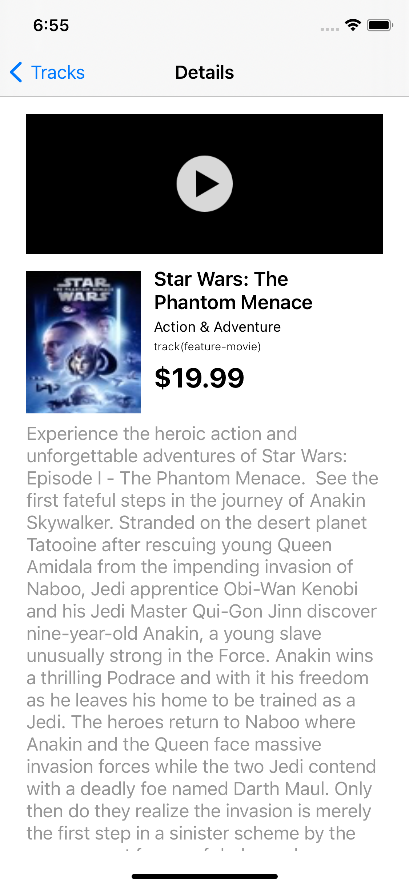

# Tan_CodingChallenge

# UI

The app was created with a grid design using UICollectionView. I Added a HeaderView to show the Date and Time of the user's last visit.

Master List            |  Search List                  |    Detail view             |   Video/Audio Player
:-------------------------:|:-------------------------: |:-------------------------: |:-------------------------:
  |   |  | 

# Architecture: MVVM-C

The architectural pattern I used in this app is MVVM-C.
I used this architecture because aside from it is what I'm used to, this architecture clearly distributes the responsibilities of each classes.

- Model = handles all data objects
- View = handles all UI or what the user's see and interacts with
- ViewModel = notifies the View if there's any changes in Model
- Coordinator = handles the navigation between views/screens

# Persistence

The app saves all tracks that were retrieved when the app has started.
It also saves the Date and Time of user's recent visit.

The persistence framework used in this app is RealmSwift.
I used this framework because it is where I am comfortable with compared to CoreData.
In my personal experience, RealmSwift was easier to learn and easier to implement because of their clear and straightforward documentations. I also used the MangoDB Realm Studio to track the app's database.

In downloading and saving images, I used the Kingfisher swift library. This library allows the image to be downloaded and cache the image automatically. It lessens the apps requests because all downloaded image will not be fetched again unless you force reload it.

In saving the Date and Time, my original plan was to use the UserDefaults object but I observered that the data saved inside the UserDefault are still persisted even if the app is uninstalled. So I used RealmSwift instead.

